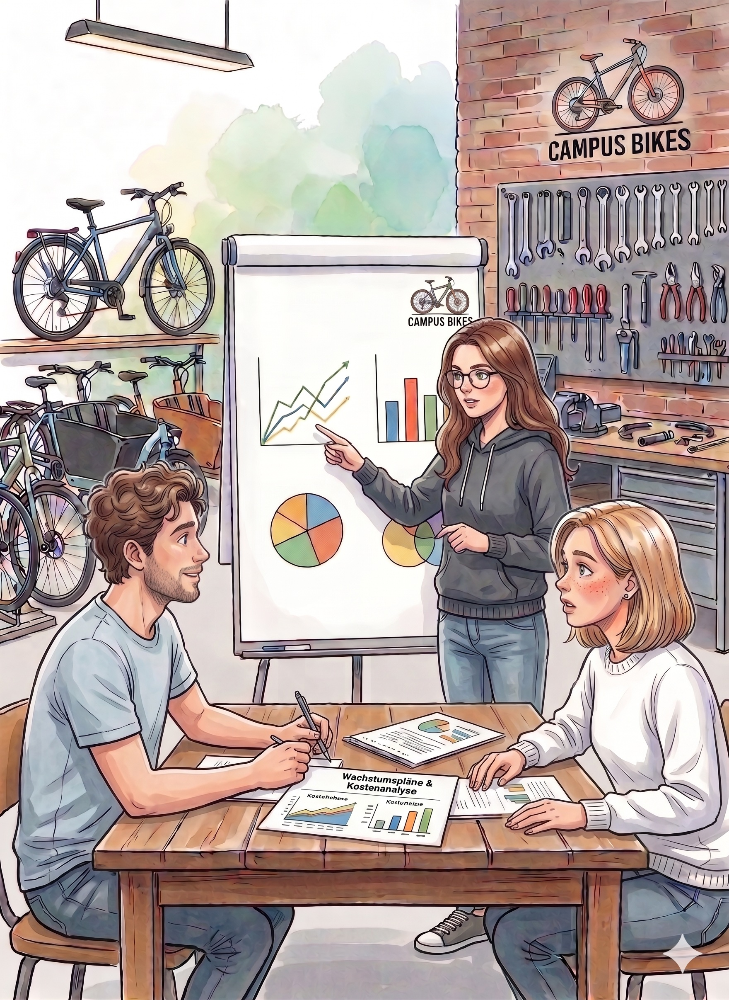

## Einleitung

CampusBikes startet in Jahr 2 mit konkreten Wachstumsplänen. Hanna, Daniel und Mia möchten mehr Reparaturtermine anbieten, den Fahrradverleih professionalisieren und ein Abo-Modell vorbereiten.

Aus Kapitel 1 ist klar geworden: Die GuV aus Jahr 1 reicht für diese Entscheidungen nicht aus. CampusBikes muss genauer verstehen, **welche Kosten entstehen**, **wie sie sich verhalten** und **wofür sie verursacht werden**.

::: {.callout-important title="Ausgangssituation"}
CampusBikes kennt bisher vor allem die Aufwendungen aus der externen Buchhaltung.\
Für Entscheidungen braucht das Team aber eine interne Sicht darauf, **welche Kostenarten entstehen**, **welche Kosten direkt zurechenbar sind** und **welche Kosten mit der Auslastung steigen**.

Hanna schaut auf die Wachstumspläne: „Bevor wir über Preise reden...wissen wir eigentlich, welche Kosten mit jedem Auftrag steigen und welche so oder so anfallen?"

Daniel nickt: „Moritz' Gehalt zahlen wir, egal ob wir 100 oder 300 Reparaturen machen. Aber die Ersatzteile hängen direkt an der Auftragszahl."

{fig-align="center" width="400"}

„Genau das müssen wir verstehen", sagt Hanna, „bevor wir irgendetwas entscheiden."

:::


## Entscheidungsfrage

Wie kann CampusBikes seine Kosten so strukturieren, dass spätere Entscheidungen zu Reparatur, Verkauf und Verleih besser vorbereitet werden?

## Relevante Plandaten für Jahr 2

Für einen typischen Monat in Jahr 2 liegen folgende Planwerte vor:

| Kostenposition | Betrag pro Monat | Hinweis |
|----------------------|----------------------------:|----------------------|
| Ersatzteile für Reparaturen | 3.600 € | abhängig von der Zahl der Reparaturen |
| Fahrradreifen für Verkauf und Reparatur | 1.200 € | direkt zurechenbar, wenn Auftrag bekannt |
| Gehalt Moritz Werkstatt | 4.000 € | festes Monatsgehalt |
| Minijob-Hilfe in Stoßzeiten | 900 € | nur bei hoher Auslastung |
| Miete Werkstattfläche | 3.063 € | Werkstatt- und Lagerfläche, monatlich fix |
| Strom Werkstatt | 650 € | 25 € Grundgebühr fix, 625 € nutzungsabhängig |
| Versicherung | 300 € | monatlich fix |
| Software für Terminbuchung | 180 € | monatliches Abo |
| Zahlungsanbietergebühren | 240 € | 25 € Grundgebühr fix, 215 € abhängig von bargeldlosen Zahlungen |
| Abschreibung Transporter | 667 € | planmäßige monatliche Abschreibung |
| Werbung | 1.000 € | Kampagne für Reparatur und Abo |
| IT-Service und digitale Infrastruktur | 1.500 € | Server, Cloud-Dienste, Softwarelizenzen |
| Verwaltungskosten | 2.500 € | Büro, Telefon, Organisation, anteilige Gründer:innenzeit |

------------------------------------------------------------------------

## Aufgabe 1

Ordnen Sie die Kostenpositionen den Kostenarten zu:

- Materialkosten
- Personalkosten
- Kapitalkosten
- sonstige Kosten

::: {.callout-note collapse="true" title="Musterlösung Aufgabe 1"}
| Kostenposition                          | Kostenart       |
|-----------------------------------------|-----------------|
| Ersatzteile für Reparaturen             | Materialkosten  |
| Fahrradreifen für Verkauf und Reparatur | Materialkosten  |
| Gehalt Moritz Werkstatt                 | Personalkosten  |
| Minijob-Hilfe in Stoßzeiten             | Personalkosten  |
| Miete Werkstattfläche                   | sonstige Kosten |
| Strom Werkstatt                         | sonstige Kosten |
| Versicherung                            | sonstige Kosten |
| Software für Terminbuchung              | sonstige Kosten |
| Zahlungsanbietergebühren                | sonstige Kosten |
| Abschreibung Transporter                | Kapitalkosten   |
| Werbung                                 | sonstige Kosten |
| IT-Service und digitale Infrastruktur   | sonstige Kosten |
| Verwaltungskosten                       | sonstige Kosten |

Die Kostenartenrechnung beantwortet zunächst die Frage: **Welche Kosten sind angefallen?**

Sie beantwortet noch nicht, **wo** die Kosten angefallen sind oder **welcher Leistung** sie zugeordnet werden sollen.
:::

------------------------------------------------------------------------

## Aufgabe 2

Ordnen Sie die Kostenpositionen danach, ob sie eher **Einzelkosten** oder **Gemeinkosten** sind.

Hinweis: Entscheidend ist, ob die Kosten einem konkreten Auftrag oder Produkt (**nicht Kostenstelle**) direkt zugerechnet werden können.

::: {.callout-note collapse="true" title="Musterlösung Aufgabe 2"}
| Kostenposition | Einordnung | Begründung |
|------------------------|------------------------|------------------------|
| Ersatzteile für Reparaturen | Einzelkosten | direkt einem Reparaturauftrag zurechenbar |
| Fahrradreifen für Verkauf und Reparatur | Einzelkosten | direkt einem Auftrag oder Verkauf zurechenbar |
| Gehalt Moritz Werkstatt | Gemeinkosten | Moritz arbeitet an vielen Aufträgen |
| Minijob-Hilfe in Stoßzeiten | Gemeinkosten | unterstützt mehrere Aufträge |
| Miete Werkstattfläche | Gemeinkosten | nicht direkt einem einzelnen Auftrag zurechenbar |
| Strom Werkstatt | Gemeinkosten | Nutzung verteilt sich auf viele Leistungen (theoretisch ggf. zurechenbar; dann aber dennoch unechte Gemeinkosten) |
| Versicherung | Gemeinkosten | allgemeine Absicherung |
| Software für Terminbuchung | Gemeinkosten (unecht) | Flatrate-Abo, das alle Leistungsbereiche nutzen; technisch wäre eine Zurechnung pro Buchung möglich, aber die Pauschale erzeugt keine echte Kausalbeziehung pro Auftrag |
| Zahlungsanbietergebühren | Gemeinkosten (unecht) | Grundgebühr (→ Gemeinkosten) plus transaktionsabhängige Gebühr (→ technisch einem Auftrag zurechenbar); hier vereinfachend als Gesamtblock behandelt |
| Abschreibung Transporter | Gemeinkosten | Transporter wird allgemein genutzt |
| Werbung | Gemeinkosten | wirkt auf mehrere Leistungen |
| IT-Service und digitale Infrastruktur | Gemeinkosten | wird von allen Leistungsbereichen genutzt |
| Verwaltungskosten | Gemeinkosten | allgemeine Organisation |

Wichtig: Einzelkosten und variable Kosten sind **nicht dasselbe**.

Eine Kostenposition kann variabel sein, aber trotzdem Gemeinkostencharakter haben.
:::

------------------------------------------------------------------------

## Aufgabe 3

Ordnen Sie die Kostenpositionen danach, ob sie eher **fix**, **variabel** oder **Mischkosten** sind.

::: {.callout-note collapse="true" title="Musterlösung Aufgabe 3"}
| Kostenposition | Kostenverhalten | Begründung |
|------------------------|------------------------|------------------------|
| Ersatzteile für Reparaturen | variabel | steigen mit der Zahl der Reparaturen |
| Fahrradreifen für Verkauf und Reparatur | variabel | steigen mit Verkauf oder Reparaturbedarf |
| Gehalt Moritz Werkstatt | fix | monatlich unabhängig von der Auslastung |
| Minijob-Hilfe in Stoßzeiten | sprungfix / variabel diskutierbar | fällt erst bei höherer Auslastung an |
| Miete Werkstattfläche | fix | unabhängig von der Auftragszahl |
| Strom Werkstatt | Mischkosten | Grundverbrauch plus nutzungsabhängiger Anteil |
| Versicherung | fix | monatlich unabhängig von der Leistung |
| Software für Terminbuchung | fix | monatliches Abo |
| Zahlungsanbietergebühren | Mischkosten | monatliche Grundgebühr (fix) plus transaktionsabhängige Komponente (variabel) |
| Abschreibung Transporter | fix | planmäßig unabhängig von aktueller Nutzung |
| Werbung | fix / entscheidungsabhängig | Kampagnenbudget unabhängig vom einzelnen Auftrag |
| IT-Service und digitale Infrastruktur | fix | monatliche Lizenz- und Systemkosten unabhängig von der Auslastung |
| Verwaltungskosten | überwiegend fix | fallen unabhängig vom einzelnen Auftrag an |

Die Einordnung ist teilweise diskussionsfähig. Entscheidend ist, dass die Begründung sachlogisch passt.
:::

------------------------------------------------------------------------

## Aufgabe 4

Aufgabe 2 und Aufgabe 3 haben zwei voneinander unabhängige Dimensionen untersucht: Einzel- vs. Gemeinkosten einerseits, fix vs. variabel andererseits. Eine variable Kostenposition ist nicht automatisch eine Einzelkostenposition, und dasselbe gilt umgekehrt.

Ordnen Sie mindestens vier Kostenpositionen aus der Datentabelle in die Matrix ein. Begründen Sie jede Zuordnung in einem Satz.

| | **Einzelkosten** | **Gemeinkosten** |
|---|---|---|
| **Variable Kosten** | | |
| **Fixe Kosten** | | |

::: {.callout-note collapse="true" title="Musterlösung Aufgabe 4"}

| | **Einzelkosten** | **Gemeinkosten** |
|---|---|---|
| **Variable Kosten** | Ersatzteile für Reparaturen | Minijob-Hilfe in Stoßzeiten |
| **Fixe Kosten** | — | Miete Werkstattfläche, Gehalt Moritz Werkstatt |

Die Kombination „fixe Einzelkosten" tritt im CampusBikes-Beispiel nicht auf. Sie ist theoretisch möglich (etwa bei einer Spezialmaschine, die exklusiv für einen Auftragstyp gemietet wird), in der Praxis aber selten.

**Kernbotschaft:** Variable Kosten sind nicht automatisch Einzelkosten, und Gemeinkosten können fix oder variabel sein. Für kurzfristige Preisentscheidungen sind die variablen Kosten maßgeblich – unabhängig davon, ob es sich um Einzel- oder Gemeinkosten handelt.

:::

------------------------------------------------------------------------

## Aufgabe 5

CampusBikes plant für den kommenden Monat mit Reparaturaufträgen. Für eine vereinfachte Betrachtung gelten:

| Größe                                |    Wert |
|--------------------------------------|--------:|
| Fixkosten pro Monat                  | 15.000 € |
| variable Kosten pro Reparaturauftrag |    32 € |
| geplanter Reparaturpreis netto       |    75 € |

::: {.callout-note title="Vereinfachung: variable Gemeinkosten im Fixkostenblock"}
Die Fixkosten von 15.000 € umfassen alle Gemeinkosten: sowohl echte Fixkosten (z. B. Miete, Gehälter) als auch variable Gemeinkosten (z. B. Minijob-Hilfe, nutzungsabhängiger Strom), die sich nicht sinnvoll pro Reparaturauftrag zurechnen lassen. Variable Gemeinkosten werden daher vereinfachend im Fixkostenblock erfasst. Diese Konvention wird in der Deckungsbeitragsrechnung in Kapitel 5 konsequent weitergeführt.
:::

Berechnen Sie für 100, 200 und 300 Reparaturaufträge:

1.  variable Gesamtkosten
2.  Gesamtkosten
3.  Stückkosten pro Reparaturauftrag
4.  Deckungsbeitrag pro Auftrag
5.  Stellen Sie das Kostenverhalten grafisch dar. Wie entwickeln sich Gesamtkosten und Stückkosten bei steigender Ausbringungsmenge?

::: {.callout-note collapse="true" title="Musterlösung Aufgabe 5"}

| Reparaturen | variable Gesamtkosten | Gesamtkosten | Stückkosten | Deckungsbeitrag pro Auftrag |
|--------------:|--------------:|--------------:|--------------:|--------------:|
| 100 | 3.200 € | 18.200 € | 182,00 € | 43 € |
| 200 | 6.400 € | 21.400 € | 107,00 € | 43 € |
| 300 | 9.600 € | 24.600 € | 82,00 € | 43 € |

Rechenweg:

- variable Gesamtkosten = Menge × 32 €
- Gesamtkosten = Fixkosten + variable Gesamtkosten
- Stückkosten = Gesamtkosten / Menge
- Deckungsbeitrag pro Auftrag = Preis – variable Kosten = 75 € – 32 € = **43 €**

**Grafische Darstellung:**

```{r}
#| echo: false
#| fig-height: 4
#| fig-cap: "Kostenverhalten im Reparaturbereich – Gesamtkosten"
library(ggplot2)
library(tidyr)

mengen <- seq(0, 400, by = 5)
df <- data.frame(
  Menge        = mengen,
  Fixkosten    = 15000,
  Var.Kosten   = 32 * mengen,
  Gesamtkosten = 15000 + 32 * mengen
)
df_long <- pivot_longer(df, -Menge, names_to = "Kostenart", values_to = "Betrag")
df_long$Kostenart <- factor(df_long$Kostenart,
  levels = c("Fixkosten", "Var.Kosten", "Gesamtkosten"),
  labels = c("Fixkosten", "Variable Kosten", "Gesamtkosten"))

ggplot(df_long, aes(x = Menge, y = Betrag, color = Kostenart, linetype = Kostenart)) +
  geom_line(linewidth = 1) +
  scale_color_manual(values = c("#999999", "#0072B2", "#D55E00")) +
  scale_y_continuous(
    labels = function(x) paste0(format(x, big.mark = ".", scientific = FALSE), " €")
  ) +
  labs(x = "Reparaturaufträge pro Monat", y = NULL, color = NULL, linetype = NULL) +
  theme_minimal(base_size = 12) +
  theme(legend.position = "bottom")
```

```{r}
#| echo: false
#| fig-height: 3.5
#| fig-cap: "Stückkosten sinken mit steigender Ausbringungsmenge"
df_stuck <- data.frame(
  Menge        = seq(20, 400, by = 5),
  Stueckkosten = (15000 + 32 * seq(20, 400, by = 5)) / seq(20, 400, by = 5)
)

ggplot(df_stuck, aes(x = Menge, y = Stueckkosten)) +
  geom_line(linewidth = 1, color = "#0072B2") +
  geom_hline(yintercept = 32, linetype = "dashed", color = "#999999") +
  annotate("text", x = 280, y = 55,
           label = "variable Stückkosten = 32 €", size = 3.5, color = "#666666") +
  scale_y_continuous(labels = function(x) paste0(x, " €"),
                     limits = c(0, 500)) +
  labs(x = "Reparaturaufträge pro Monat", y = NULL) +
  theme_minimal(base_size = 12)
```

Die Gesamtkosten steigen linear mit der Ausbringungsmenge. Die Stückkosten sinken, weil sich die Fixkosten auf immer mehr Aufträge verteilen. Sie nähern sich asymptotisch den variablen Stückkosten (32 €) an.

Für CampusBikes bedeutet das: Eine höhere Auslastung senkt die Stückkosten und verbessert die Wirtschaftlichkeit, solange ausreichend Kapazität vorhanden ist.

:::

------------------------------------------------------------------------

## Aufgabe 6

CampusBikes möchte einige Gemeinkosten für die nächste Analyse auf die Leistungsbereiche Reparatur, Verkauf und Verleih/Abo verteilen.

Beurteilen Sie, welcher Verteilungsschlüssel jeweils sachlogisch geeignet ist.

| Gemeinkostenart       |  Betrag |
|-----------------------|--------:|
| Miete Werkstattfläche | 3.063 € |
| Strom Werkstatt       |   650 € |
| Werbung               | 1.000 € |
| Verwaltungskosten     | 2.500 € |

::: {.callout-note collapse="true" title="Musterlösung Aufgabe 6"}
| Gemeinkostenart | geeigneter Schlüssel | Begründung |
|------------------------|------------------------|------------------------|
| Miete Werkstattfläche | genutzte Fläche | Raumkosten entstehen durch Flächennutzung |
| Strom Werkstatt | Maschinenstunden / Nutzungszeit | Strom hängt teilweise von der Nutzung der Werkstatt ab |
| Werbung | Kampagnenfokus | Werbung sollte dort belastet werden, wo sie Wirkung erzeugen soll |
| Verwaltungskosten | Anzahl Vorgänge | Verwaltung entsteht häufig durch Bestellungen, Rechnungen, Termine und Kundenkontakte |

Es gibt nicht immer genau einen richtigen Schlüssel.

Wichtig ist, dass der Schlüssel wirtschaftlich nachvollziehbar ist und nicht nur rechnerisch bequem gewählt wird.
:::

------------------------------------------------------------------------

## Was CampusBikes jetzt weiß

CampusBikes hat die Kostenstruktur für Jahr 2 systematisch aufbereitet:

| Dimension | Erkenntnis |
|---|---|
| Welche Kostenarten entstehen? | Material-, Personal-, Kapital- und sonstige Kosten |
| Wie verhalten sich Kosten bei Mengenänderung? | Fix, variabel oder Mischkosten |
| Welche Kosten sind direkt zurechenbar? | Einzelkosten (z. B. Ersatzteile) vs. Gemeinkosten (z. B. Miete, Gehälter) |
| Was kostet ein Reparaturauftrag an variablen Kosten? | 32 € (Grundlage für spätere Preis- und Deckungsbeitragsentscheidungen) |

CampusBikes entscheidet, die Gemeinkosten im nächsten Schritt auf Kostenstellen zu verteilen.

::: {.callout-tip title="Weiterarbeit"}
Im nächsten Kapitel wird aus der Kostenartenübersicht ein einfacher **Betriebsabrechnungsbogen** aufgebaut.
:::
