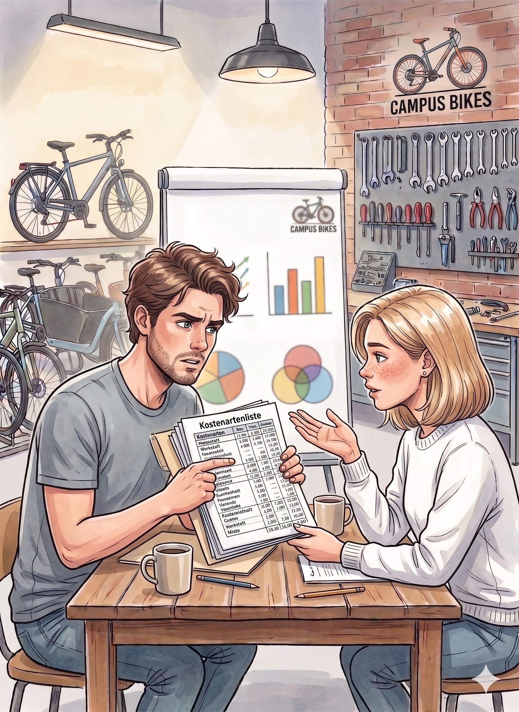

## Einleitung

CampusBikes hat im letzten Kapitel die wichtigsten Kostenarten strukturiert. Hanna, Daniel und Mia wissen jetzt besser, **welche Kosten entstehen**.

Für die nächste Entscheidung reicht das jedoch noch nicht aus. Viele Gemeinkosten entstehen nicht direkt für ein einzelnes Fahrrad oder eine einzelne Reparatur.

::: {.callout-important title="Ausgangssituation"}
Für spätere Preisentscheidungen muss das Team aber zusätzlich verstehen, **wo Gemeinkosten entstehen** und **wie sie auf die Leistungsbereiche verteilt werden können**.

Daniel zieht die Kostenartenliste aus Kapitel 2 hervor: „Ich sehe, was wir ausgeben. Aber ich weiß immer noch nicht, ob die Werkstatt für sich allein profitabel ist oder ob sie von den anderen Bereichen quersubventioniert wird."

{fig-align="center" width="400"}

„Das liegt daran, dass wir die Gemeinkosten noch nirgends zugeordnet haben", sagt Mia. „Miete, IT, Verwaltung...alles schwimmt noch im gemeinsamen Topf."

:::

## Entscheidungsfrage

Wie kann CampusBikes Gemeinkosten verursachungsgerecht auf Kostenstellen verteilen und daraus Zuschlagsätze für spätere Kalkulationen ableiten?

::: {.callout-note title="Verbindung zu Kapitel 2: Woher kommen die Primärkosten?"}
Die **15.000 € Gemeinkosten** aus der Datentabelle in [Kapitel 2](02-kostenarten.qmd) fließen als Primärkosten in den Betriebsabrechnungsbogen. Dabei gilt:

- **IT-Service** (1.500 €) und **Verwaltungskosten** (2.500 €) lassen sich direkt als eigene Kostenstellen identifizieren und werden als Hilfskostenstellen geführt.
- Die übrigen **11.000 €** (darunter Gehalt Moritz, Minijob-Hilfe, Miete, Strom, Versicherung, Software, Zahlungsanbietergebühren, Abschreibung und Werbung) werden den drei Hauptkostenstellen Werkstatt, Verkauf und Verleih/Abo als Primärkosten zugewiesen.
- Die **variablen Einzelkosten** (Ersatzteile 3.600 €, Fahrradreifen 1.200 €) durchlaufen den BAB nicht, sondern werden direkt dem Kostenträger zugerechnet und tauchen daher in den Primärkosten nicht auf.
:::

## Relevante Plandaten für Jahr 2

CampusBikes bildet folgende Kostenstellen:

| Kostenstelle | Typ |
|---|---|
| Werkstatt | Hauptkostenstelle |
| Verkauf | Hauptkostenstelle |
| Verleih/Abo | Hauptkostenstelle |
| Verwaltung | Hilfskostenstelle |
| IT-Service | Hilfskostenstelle |

Die Primärkosten eines typischen Monats betragen:

| Kostenstelle | Primärkosten |
|---|---:|
| Werkstatt | 6.000 € |
| Verkauf | 3.000 € |
| Verleih/Abo | 2.000 € |
| Verwaltung | 2.500 € |
| IT-Service | 1.500 € |

Die Hilfskostenstellen erbringen Leistungen für andere Kostenstellen:

| Leistender Bereich | Empfänger | Anteil |
|---|---|---:|
| Verwaltung | Werkstatt | 40 % |
| Verwaltung | Verkauf | 35 % |
| Verwaltung | Verleih/Abo | 15 % |
| Verwaltung | IT-Service | 10 % |
    
    
| Leistender Bereich | Empfänger | Anteil |
|---|---|---:|
| IT-Service | Werkstatt | 50 % |
| IT-Service | Verkauf | 30 % |
| IT-Service | Verleih/Abo | 15 % |
| IT-Service | Verwaltung | 5 % |

---

## Aufgabe 1

Erläutern Sie kurz den Zweck der Kostenstellenrechnung.

Warum reicht die reine Kostenartenrechnung für CampusBikes nicht aus?

::: {.callout-note collapse="true" title="Musterlösung Aufgabe 1"}

Die Kostenartenrechnung beantwortet vor allem:

**Welche Kosten entstehen?**

Die Kostenstellenrechnung beantwortet zusätzlich:

**Wo entstehen diese Kosten?**

Für CampusBikes ist das wichtig, weil viele Gemeinkosten nicht direkt einem Fahrrad, einer Reparatur oder einem Abo zugeordnet werden können. Erst über Kostenstellen kann das Team erkennen, welche Bereiche besonders viele Gemeinkosten verursachen.

:::

---

## Aufgabe 2

Wenden Sie mit den o.g. Daten das **Treppenumlageverfahren** an.

Reihenfolge:

1. Verwaltung
2. IT-Service

a) Ermitteln Sie die Endkosten der Hauptkostenstellen.

b) Erklären Sie die systematische Schwäche des Treppenumlageverfahrens: Welche Leistungsbeziehung zwischen den Hilfskostenstellen wird nicht berücksichtigt, und warum kann das zu einer ungenauen Kostenverteilung führen?

::: {.callout-note collapse="true" title="Musterlösung Aufgabe 2"}

### Schritt 1: Verwaltung verteilen

Gesamtkosten Verwaltung: 2.500 €

| Empfänger | Anteil | Betrag |
|---|---:|---:|
| Werkstatt | 40 % | 1.000 € |
| Verkauf | 35 % | 875 € |
| Verleih/Abo | 15 % | 375 € |
| IT-Service | 10 % | 250 € |

Neue Kosten IT-Service:

\[
1.500 + 250 = 1.750
\]

### Schritt 2: IT-Service verteilen

Beim Treppenumlageverfahren wird die Rückleistung an die Verwaltung nicht mehr berücksichtigt.
Die verbleibenden Anteile werden daher auf 100 % hochgerechnet:

| Empfänger | ursprünglicher Anteil | umgerechneter Anteil |
|---|---:|---:|
| Werkstatt | 50 % | 52,63 % |
| Verkauf | 30 % | 31,58 % |
| Verleih/Abo | 15 % | 15,79 % |

Verteilung der IT-Kosten:

| Empfänger | Betrag |
|---|---:|
| Werkstatt | 921,05 € |
| Verkauf | 552,63 € |
| Verleih/Abo | 276,32 € |

### Endkosten

| Kostenstelle | Rechnung | Endkosten |
|---|---|---:|
| Werkstatt | 6.000 + 1.000 + 921,05 | 7.921,05 € |
| Verkauf | 3.000 + 875 + 552,63 | 4.427,63 € |
| Verleih/Abo | 2.000 + 375 + 276,32 | 2.651,32 € |

### Schwäche des Treppenumlageverfahrens

Beim Treppenumlageverfahren werden die Hilfskostenstellen in einer festgelegten Reihenfolge abgearbeitet. Sobald eine Kostenstelle ihre Kosten vollständig weitergegeben hat, erhält sie selbst keine weiteren Kosten mehr.

Im CampusBikes-Beispiel: Der IT-Service liefert 5 % seiner Leistung an die Verwaltung. Diese Rückleistung wird ignoriert, weil die Verwaltung bereits vollständig abgerechnet wurde: Sie steht in der Reihenfolge vor dem IT-Service.

Folge: Die Gesamtkosten des IT-Service werden zu niedrig angesetzt, weil die 5 % Verwaltungsleistung, die er empfängt, nicht mehr einfließen. Die Endkosten der Hauptkostenstellen sind dadurch leicht verzerrt.

Je stärker die gegenseitigen Leistungsbeziehungen zwischen den Hilfskostenstellen, desto größer die potenzielle Ungenauigkeit und desto eher lohnt sich der höhere Rechenaufwand des Gleichungsverfahrens (Aufgabe 3).

:::

---

## Aufgabe 3

Wenden Sie nun das **Gleichungsverfahren** an.

Berücksichtigen Sie dabei die gegenseitigen Leistungen zwischen Verwaltung und IT-Service vollständig.

::: {.callout-note collapse="true" title="Musterlösung Aufgabe 3"}

Die Gesamtleistungsmenge jeder Hilfskostenstelle wird auf 100 Leistungseinheiten (LE) normiert. Die Verrechnungspreise $k_V$ und $k_{IT}$ (€/LE) sind die Unbekannten.

Gleichung für Verwaltung (gibt 100 LE ab, empfängt 5 LE von IT):

$$100 \cdot k_V = 2.500 + 5 \cdot k_{IT}$$

Gleichung für IT-Service (gibt 100 LE ab, empfängt 10 LE von Verwaltung):

$$100 \cdot k_{IT} = 1.500 + 10 \cdot k_V$$

**Lösung des Gleichungssystems:**

Aus der ersten Gleichung:

$$k_V = 25 + 0{,}05 \cdot k_{IT}$$

Einsetzen in die zweite Gleichung:

$$100 \cdot k_{IT} = 1.500 + 10 \cdot (25 + 0{,}05 \cdot k_{IT})$$

$$100 \cdot k_{IT} = 1.750 + 0{,}5 \cdot k_{IT}$$

$$99{,}5 \cdot k_{IT} = 1.750$$

$$k_{IT} \approx 17{,}59 \text{ €/LE}$$

$$k_V = 25 + 0{,}05 \times 17{,}59 \approx 25{,}88 \text{ €/LE}$$

**Gesamtkosten der Hilfskostenstellen** (100 LE × exakter Verrechnungspreis):

$$K_V = 2.587{,}94 \text{ €}$$

$$K_{IT} = 1.758{,}79 \text{ €}$$

### Verteilung Verwaltung auf Hauptkostenstellen

| Empfänger | Leistungsmenge | Betrag |
|---|---:|---:|
| Werkstatt | 40 LE × $k_V$ = 40 % × 2.587,94 € | 1.035,18 € |
| Verkauf | 35 LE × $k_V$ = 35 % × 2.587,94 € | 905,78 € |
| Verleih/Abo | 15 LE × $k_V$ = 15 % × 2.587,94 € | 388,19 € |

### Verteilung IT-Service auf Hauptkostenstellen

| Empfänger | Leistungsmenge | Betrag |
|---|---:|---:|
| Werkstatt | 50 LE × $k_{IT}$ = 50 % × 1.758,79 € | 879,40 € |
| Verkauf | 30 LE × $k_{IT}$ = 30 % × 1.758,79 € | 527,64 € |
| Verleih/Abo | 15 LE × $k_{IT}$ = 15 % × 1.758,79 € | 263,82 € |

### Endkosten

| Kostenstelle | Rechnung | Endkosten |
|---|---|---:|
| Werkstatt | 6.000 + 1.035,18 + 879,40 | 7.914,58 € |
| Verkauf | 3.000 + 905,78 + 527,64 | 4.433,42 € |
| Verleih/Abo | 2.000 + 388,19 + 263,82 | 2.652,01 € |

:::

---

## Aufgabe 4

Vergleichen Sie Treppenumlageverfahren und Gleichungsverfahren.

Welche Methode sollte CampusBikes verwenden?

::: {.callout-note collapse="true" title="Musterlösung Aufgabe 4"}

| Kostenstelle | Treppenumlage | Gleichungsverfahren | Differenz |
|---|---:|---:|---:|
| Werkstatt | 7.921,05 € | 7.914,58 € | -6,47 € |
| Verkauf | 4.427,63 € | 4.433,42 € | +5,79 € |
| Verleih/Abo | 2.651,32 € | 2.652,01 € | +0,69 € |

Die Unterschiede sind hier gering.

Für CampusBikes bedeutet das:

- Das Treppenumlageverfahren ist schneller und einfacher.
- Das Gleichungsverfahren ist theoretisch genauer.
- Bei geringen gegenseitigen Leistungen reicht das Treppenumlageverfahren oft aus.
- Bei stark verflochtenen Servicebereichen wäre das Gleichungsverfahren sinnvoller.

Managemententscheidung:

CampusBikes kann zunächst mit dem Treppenumlageverfahren arbeiten. Wenn IT und Verwaltung weiter wachsen, sollte auf das Gleichungsverfahren umgestellt werden.

:::

---

## Aufgabe 5

Berechnen Sie auf Basis des Gleichungsverfahrens die Gemeinkostenzuschlagsätze für alle drei Hauptkostenstellen.

Zusätzliche Informationen zu den Bezugsgrößen:

| Kostenstelle | Bezugsgröße | Betrag pro Monat | Begründung |
|---|---|---:|---|
| Werkstatt | Fertigungslöhne | 5.250 € | Reparatur ist arbeitsintensiv; Löhne spiegeln den Ressourceneinsatz wider |
| Verkauf | Materialeinzelkosten (MEK) | 4.000 € | Typischer MEK-Zuschlag im Handel; ca. 13 Fahrräder à Ø 300 € Einkaufspreis |
| Verleih/Abo | Direkte Personalkosten | 1.200 € | Studentische Hilfskraft für Ausgabe, Rücknahme und Zustandsprüfung (~100 h × 12 €/h) |

::: {.callout-note collapse="true" title="Musterlösung Aufgabe 5"}

### Werkstatt

$$\text{GK-Zuschlagsatz}_\text{Werkstatt} = \frac{7.914{,}58}{5.250} \times 100 = 150{,}75\%$$

Für 100 € Fertigungslöhne fallen rund 150,75 € Werkstattgemeinkosten an.

### Verkauf

$$\text{GK-Zuschlagsatz}_\text{Verkauf} = \frac{4.433{,}42}{4.000} \times 100 = 110{,}84\%$$

Für 100 € Wareneinsatz fallen rund 110,84 € Verkaufsgemeinkosten an.

### Verleih/Abo

$$\text{GK-Zuschlagsatz}_\text{Verleih} = \frac{2.652{,}01}{1.200} \times 100 = 221{,}0\%$$

Für 100 € direkte Personalkosten fallen rund 221 € Verleihgemeinkosten an.

### Interpretation im Vergleich

| Kostenstelle | Endkosten (GV) | Bezugsgröße | GK-Zuschlagsatz |
|---|---:|---:|---:|
| Werkstatt | 7.914,58 € | 5.250 € | 150,75 % |
| Verkauf | 4.433,42 € | 4.000 € | 110,84 % |
| Verleih/Abo | 2.652,01 € | 1.200 € | 221,00 % |

Der hohe Zuschlagsatz beim Verleih überrascht auf den ersten Blick besonders Mia, die für das Abo-Geschäft zuständig ist:

> *„Für jeden Euro, den ich direkt in den Verleih stecke, kommen noch mal 2,21 Euro Gemeinkosten dazu?"*

Er zeigt: Verleih mag pro Transaktion günstig wirken, bindet aber gemessen an den direkten Kosten überproportional viele Gemeinkosten für IT, Service und Verwaltung. Das ist eine erste wichtige Erkenntnis für spätere Sortimentsentscheidungen.

:::

---

## Was CampusBikes jetzt weiß

CampusBikes verfügt nun über:

- verrechnete Kostenstellenkosten für alle Bereiche,
- einen Vergleich zwischen Treppenumlage- und Gleichungsverfahren,
- und Gemeinkostenzuschlagsätze für alle drei Hauptkostenstellen:

| Kostenstelle | GK-Zuschlagsatz | Bezugsgröße |
|---|---:|---|
| Werkstatt | 150,75 % | Fertigungslöhne |
| Verkauf | 110,84 % | Materialeinzelkosten |
| Verleih/Abo | 221,00 % | Direkte Personalkosten |

::: {.callout-tip title="Weiterarbeit"}
Im nächsten Kapitel werden diese Zuschlagsätze genutzt, um je einen konkreten Kostenträger pro Bereich zu kalkulieren: eine Standard-Reparatur, ein Stadtfahrrad und ein Semester-Abo.
:::