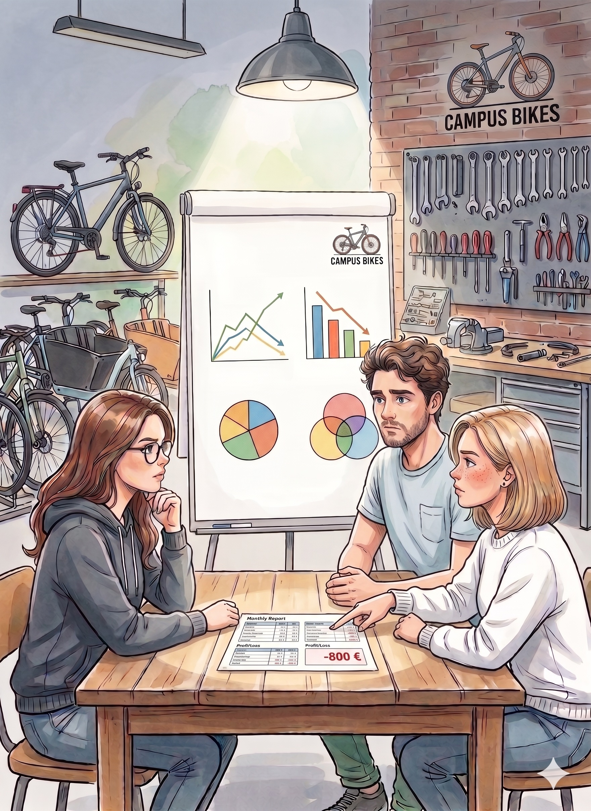

## Einleitung

CampusBikes ist in Jahr 2 voll operativ: Reparaturen laufen gut, der Fahrradverkauf hat begonnen, und das Abo-Modell gewinnt langsam Kunden. Doch beim Blick auf die Monatszahlen stellt Daniel fest: Das Unternehmen erwirtschaftet trotz Umsatz noch keinen sicheren Gewinn.

::: {.callout-important title="Ausgangssituation"}
Die [Vollkostenrechnung aus Kapitel 4](04-kostentraeger.qmd) zeigt, dass alle drei Leistungen über ihren Selbstkosten angeboten werden.
Dennoch fragt sich das Team: **Welche Leistungen tragen kurzfristig wirklich zum Ergebnis bei?**
Und: **Wie viele Aufträge, Verkäufe und Abos braucht CampusBikes mindestens, um kostendeckend zu arbeiten?**

Der Monatsbericht zeigt: Alle Preise decken die Selbstkosten und dennoch ist das Betriebsergebnis **−800 €**. Das Team starrt auf dieselbe Zahl. Mia tippt auf den Ausdruck: „Entweder stimmt die Kalkulation nicht, oder wir stellen die falsche Frage."

{fig-align="center" width="400"}

Mia hat recht: Die Vollkostenrechnung beantwortet eine andere Frage, nämlich ob ein Preis alle Kosten deckt. Was fehlt, ist der Blick auf das, was jede Leistung kurzfristig zum Ergebnis beiträgt. Und ab wann sie sich überhaupt lohnt...

:::


## Entscheidungsfrage

Welche der drei Leistungsbereiche sind kurzfristig profitabel und wo liegt der Break-Even-Point?

## Plandaten für den laufenden Monat

Die folgende Übersicht fasst die relevanten Größen pro Einheit zusammen. Die Preise (gerundet) entstammen [Kapitel 4](04-kostentraeger.qmd), die variablen Kosten den [Kapiteln 2](02-kostenarten.qmd) und 4.

| | Reparatur | Stadtfahrrad | Monatsabo |
|---|---:|---:|---:|
| Preis pro Einheit | 75 € | 300 € | 32 € |
| Variable Kosten pro Einheit | 32 € | 120 € | 12 € |
| Geplante Menge pro Monat | 200 | 20 | 100 |

Die Fixkosten sind zweistufig strukturiert. **Bereichsfixkosten** umfassen die Primärkosten, die direkt einem Bereich zuzurechnen sind und entfielen, wenn der Bereich geschlossen würde. **Unternehmensfixkosten** umfassen die Hilfskosten (Verwaltung + IT-Service aus Kapitel 3), die als gemeinsame Infrastruktur unabhängig davon anfallen, welche Bereiche betrieben werden:

| Kostenebene | Betrag |
|---|---:|
| Bereichsfixkosten Werkstatt (Reparatur) | 6.000 € |
| Bereichsfixkosten Verkauf (Stadtfahrrad) | 3.000 € |
| Bereichsfixkosten Verleih/Abo (Monatsabo) | 2.000 € |
| Unternehmensfixkosten (Verwaltung + IT-Service) | 4.000 € |
| **Fixkosten gesamt** | **15.000 €** |

::: {.callout-note title="Vereinfachung: Gemeinkosten als Fixkostenblock"}
Wie bereits in [Kapitel 2](02-kostenarten.qmd) (Aufgabe 5) eingeführt: Alle Gemeinkosten, auch variable (z. B. Minijob-Hilfe, nutzungsabhängiger Strom), werden im Fixkostenblock erfasst, weil sie sich nicht verursachungsgerecht auf einzelne Leistungseinheiten zurechnen lassen.
:::

---

## Aufgabe 1

Das Studentenwerk möchte bei den 30 Reparaturen aus dem Rahmenvertrag einen Sonderrabatt aushandeln und bietet einen Pauschalpreis von **55 € pro Inspektion** an.

a) Würde CampusBikes unter Vollkostenrechnung (Kapitel 4) diesen Auftrag annehmen?

b) Wie lautet die Antwort unter Teilkostenrechnung?

c) Erläutern Sie, warum die Teilkostenrechnung für **kurzfristige** Preisentscheidungen besser geeignet ist als die Vollkostenrechnung.

::: {.callout-note collapse="true" title="Musterlösung Aufgabe 1"}

**a) Vollkostenrechnung**

Selbstkosten Standard-Inspektion (aus [Kapitel 4](04-kostentraeger.qmd)): **65,15 €**

55 € < 65,15 € → Der Angebotspreis deckt die Selbstkosten nicht. Unter Vollkostenrechnung würde CampusBikes den Auftrag **ablehnen**.

**b) Teilkostenrechnung**

Variable Kosten pro Inspektion: **32 €**

55 € > 32 € → Deckungsbeitrag pro Inspektion = 55 − 32 = **23 €**

Für 30 Inspektionen: 30 × 23 € = **690 € zusätzlicher Deckungsbeitrag**

Dieser Beitrag hilft, die Fixkosten des Unternehmens zu decken, die ohnehin anfallen. CampusBikes sollte den Auftrag **annehmen** solange freie Kapazität vorhanden ist.

**c) Warum Teilkostenrechnung für kurzfristige Entscheidungen?**

Die Vollkostenrechnung verteilt Fixkosten auf einzelne Einheiten. Das ergibt sinnvolle Angebotspreise für die Normalauslastung, ist aber für kurzfristige Entscheidungen irreführend.

Fixkosten fallen unabhängig davon an, ob der Zusatzauftrag angenommen wird oder nicht. Maßgeblich ist einzig, ob der Preis die **variablen Kosten** deckt und darüber hinaus einen Beitrag zur Deckung der Fixkosten leistet.

**Faustregel:** Solange gilt Preis > variable Kosten, ist jeder Auftrag kurzfristig besser als kein Auftrag.

:::

---

## Aufgabe 2

Berechnen Sie für alle drei Leistungsbereiche:

1. den Deckungsbeitrag pro Einheit,
2. den gesamten Deckungsbeitrag I pro Bereich,
3. sowie den Gesamtdeckungsbeitrag I des Unternehmens.

::: {.callout-note collapse="true" title="Musterlösung Aufgabe 2"}

| | Reparatur | Stadtfahrrad | Monatsabo | Gesamt |
|---|---:|---:|---:|---:|
| Preis | 75 € | 300 € | 32 € | |
| − Variable Kosten/Einheit | 32 € | 120 € | 12 € | |
| **= DB pro Einheit** | **43 €** | **180 €** | **20 €** | |
| × Menge | 200 | 20 | 100 | |
| **= DB I gesamt** | **8.600 €** | **3.600 €** | **2.000 €** | **14.200 €** |

Der Gesamtumsatz beträgt: 200 × 75 + 20 × 300 + 100 × 32 = 15.000 + 6.000 + 3.200 = **24.200 €**

Der DB I von 14.200 € steht zur Deckung der gesamten Fixkosten (15.000 €) zur Verfügung.

Interpretation: Da DB I (14.200 €) kleiner als die Gesamtfixkosten (15.000 €) ist, macht CampusBikes in diesem Monat noch einen Verlust von 800 €.

Den stärksten Beitrag liefert die **Reparatur** mit 8.600 € (61 % des Gesamt-DB I), gefolgt vom **Fahrradverkauf** (3.600 €) und dem **Monatsabo** (2.000 €).

Ob ein einzelner Bereich das Minus verursacht oder ob die gemeinsame Infrastruktur das eigentliche Problem ist, zeigt die mehrstufige Deckungsbeitragsrechnung in Aufgabe 3.

:::

---

## Aufgabe 3

Erstellen Sie eine **mehrstufige Deckungsbeitragsrechnung** mit den Bereichsfixkosten aus der Datentabelle.

Welche Schlussfolgerungen ziehen Sie für die Sortimentsgestaltung von CampusBikes?

::: {.callout-note collapse="true" title="Musterlösung Aufgabe 3"}

| | Reparatur | Stadtfahrrad | Monatsabo | Gesamt |
|---|---:|---:|---:|---:|
| Umsatz | 15.000 € | 6.000 € | 3.200 € | 24.200 € |
| − Variable Kosten | 6.400 € | 2.400 € | 1.200 € | 10.000 € |
| **= DB I** | **8.600 €** | **3.600 €** | **2.000 €** | **14.200 €** |
| − Bereichsfixkosten | 6.000 € | 3.000 € | 2.000 € | 11.000 € |
| **= DB II** | **2.600 €** | **600 €** | **0 €** | **3.200 €** |
| − Unternehmensfixkosten | | | | 4.000 € |
| **= Betriebsergebnis** | | | | **−800 €** |

**Interpretation:**

- Alle drei Bereiche erzielen einen **nicht-negativen DB II**: Die Reparatur trägt 2.600 €, der Fahrradverkauf 600 € und das Monatsabo deckt seine Bereichsfixkosten exakt (DB II = 0 €).
- Das Unternehmensminus von −800 € entsteht allein durch die **Unternehmensfixkosten** (Verwaltung + IT-Service: 4.000 €), die den DB-II-Überschuss von 3.200 € übersteigen.

**Sortimentsentscheidung:**

Kein Bereich sollte aufgegeben werden: Alle drei decken ihre direkten Kosten. Das eigentliche Problem liegt in der gemeinsamen Infrastruktur: Die 4.000 € Overhead (Verwaltung + IT) werden durch das laufende Geschäft noch nicht vollständig gedeckt.

Mittelfristig kann CampusBikes das Betriebsergebnis durch Wachstum in allen Bereichen verbessern. Jeder zusätzliche Euro DB II fließt direkt in die Deckung der Unternehmensfixkosten.

## Interaktive Deckungsbeitragsrechnung

Stellen Sie die Mengen für alle drei Bereiche ein und beobachten Sie, wie sich DB I, DB II und das Betriebsergebnis verändern.

```{ojs}
viewof m_rep  = Inputs.range([0, 400], {value: 200, step: 5, label: "Reparaturen / Monat"})
viewof m_fahr = Inputs.range([0, 60],  {value: 20,  step: 1, label: "Fahrräder / Monat"})
viewof m_abo  = Inputs.range([0, 200], {value: 100, step: 5, label: "Abonnements / Monat"})
```

```{ojs}
db1_rep  = 43  * m_rep
db1_fahr = 180 * m_fahr
db1_abo  = 20  * m_abo
db1_ges  = db1_rep + db1_fahr + db1_abo

db2_rep  = db1_rep  - 6000
db2_fahr = db1_fahr - 3000
db2_abo  = db1_abo  - 2000
db2_ges  = db2_rep + db2_fahr + db2_abo

ergebnis = db2_ges - 4000

function cell(v, bold = false) {
  const col = v < 0 ? "#c0392b" : v === 0 ? "#555" : "#1a5253"
  const fw  = bold ? "700" : "400"
  const abs = Math.abs(v).toLocaleString("de-DE")
  return `<td style="padding:0.4rem 0.8rem;text-align:right;color:${col};font-weight:${fw};">${v < 0 ? "−" : ""}${abs} €</td>`
}

html`<table style="width:100%;font-size:0.93rem;border-collapse:collapse;">
  <thead>
    <tr style="background:#2c7a7b;color:#fff;">
      <th style="padding:0.4rem 0.8rem;text-align:left;"></th>
      <th style="padding:0.4rem 0.8rem;text-align:right;">Reparatur</th>
      <th style="padding:0.4rem 0.8rem;text-align:right;">Stadtfahrrad</th>
      <th style="padding:0.4rem 0.8rem;text-align:right;">Monatsabo</th>
      <th style="padding:0.4rem 0.8rem;text-align:right;">Gesamt</th>
    </tr>
  </thead>
  <tbody>
    <tr style="background:#f0f8f8;">
      <td style="padding:0.4rem 0.8rem;">DB I</td>
      ${cell(db1_rep)} ${cell(db1_fahr)} ${cell(db1_abo)} ${cell(db1_ges)}
    </tr>
    <tr>
      <td style="padding:0.4rem 0.8rem;">− Bereichsfixkosten</td>
      <td style="padding:0.4rem 0.8rem;text-align:right;color:#555;">6.000 €</td>
      <td style="padding:0.4rem 0.8rem;text-align:right;color:#555;">3.000 €</td>
      <td style="padding:0.4rem 0.8rem;text-align:right;color:#555;">2.000 €</td>
      <td style="padding:0.4rem 0.8rem;text-align:right;color:#555;">11.000 €</td>
    </tr>
    <tr style="background:#f0f8f8;border-top:2px solid #d0d0d0;">
      <td style="padding:0.4rem 0.8rem;font-weight:600;">= DB II</td>
      ${cell(db2_rep, true)} ${cell(db2_fahr, true)} ${cell(db2_abo, true)} ${cell(db2_ges, true)}
    </tr>
    <tr>
      <td style="padding:0.4rem 0.8rem;">− Unternehmensfixkosten</td>
      <td colspan="3"></td>
      <td style="padding:0.4rem 0.8rem;text-align:right;color:#555;">4.000 €</td>
    </tr>
    <tr style="border-top:2px solid #2c7a7b;">
      <td style="padding:0.4rem 0.8rem;font-weight:700;">= Betriebsergebnis</td>
      <td colspan="3"></td>
      ${cell(ergebnis, true)}
    </tr>
  </tbody>
</table>`
```

:::

---

## Aufgabe 4

Ermitteln Sie den **Break-Even-Point** für den Reparaturbereich.

a) Berechnen Sie die Break-Even-Menge rechnerisch.

b) Berechnen Sie den **Sicherheitskoeffizienten** und interpretieren Sie ihn.

c) Stellen Sie den Break-Even-Point grafisch dar.

::: {.callout-note collapse="true" title="Musterlösung Aufgabe 4"}

**a) Break-even-Menge**

$$
x_{BE} = \frac{\text{Bereichsfixkosten Reparatur}}{\text{DB pro Einheit}} = \frac{6.000}{43} \approx 140 \text{ Aufträge}
$$

Ab 140 Aufträgen deckt der Reparaturbereich seine Bereichsfixkosten. Jeder weitere Auftrag erhöht den DB II und damit den Beitrag zur Deckung der Unternehmensfixkosten.

*Hinweis zur Rechnung: Das rechnerische Ergebnis (139,53) wird auf 140 aufgerundet, da es keinen halben Auftrag gibt.*

**b) Sicherheitskoeffizient**

$$
SK = \frac{\text{Ist-Menge} - \text{Break-even-Menge}}{\text{Ist-Menge}} = \frac{200 - 140}{200} = 30\%
$$

CampusBikes kann die geplante Reparaturmenge um 30 % unterschreiten, bevor der Reparaturbereich seine direkten Kosten nicht mehr deckt. Das ist eine **solide Sicherheitsmarge**: Der Bereich ist gegenüber normalen Nachfrageschwankungen gut abgesichert.

**c) Grafische Darstellung**

```{r}
#| echo: false
#| fig-height: 4
#| fig-cap: "Break-even-Analyse im Reparaturbereich"
library(ggplot2)
library(tidyr)

n   <- seq(0, 300, by = 5)
bep <- 6000 / (75 - 32)

df <- data.frame(
  Auftraege    = n,
  Umsatz       = 75 * n,
  Gesamtkosten = 6000 + 32 * n
)
df_long <- pivot_longer(df, -Auftraege, names_to = "Linie", values_to = "Euro")
df_long$Linie <- factor(df_long$Linie, levels = c("Gesamtkosten", "Umsatz"))

ggplot(df_long, aes(x = Auftraege, y = Euro, color = Linie, linetype = Linie)) +
  geom_line(linewidth = 1) +
  geom_vline(xintercept = bep,  linetype = "dotted", color = "gray50") +
  geom_vline(xintercept = 200,  linetype = "dashed",  color = "#009E73") +
  annotate("text", x = bep - 5, y = 4500,
           label = paste0("Break-even\n≈ ", ceiling(bep), " Aufträge"),
           size = 3.5, hjust = 1, color = "gray40") +
  annotate("text", x = 205, y = 2000,
           label = "Ist-Menge\n200 Aufträge",
           size = 3.5, hjust = 0, color = "#009E73") +
  scale_color_manual(values = c("#D55E00", "#0072B2")) +
  scale_y_continuous(
    labels = function(x) paste0(format(x, big.mark = ".", scientific = FALSE), " €")
  ) +
  labs(x = "Reparaturaufträge pro Monat", y = NULL, color = NULL, linetype = NULL) +
  theme_minimal(base_size = 12) +
  theme(legend.position = "bottom")
```

Die Grafik zeigt: Unterhalb von 140 Aufträgen übersteigen die Bereichskosten den Umsatz (Verlustzone auf Bereichsebene). Bei der aktuellen Menge von 200 Aufträgen liegt CampusBikes 60 Aufträge oberhalb des Break-evens; der Reparaturbereich ist damit gut abgesichert.

:::

---

## Aufgabe 5

Das Team diskutiert drei Szenarien für den Reparaturbereich. Analysieren Sie jeweils die Auswirkung auf Break-Even-Menge, Sicherheitskoeffizient und monatliches Betriebsergebnis des Bereichs.

| Szenario | Veränderung |
|---|---|
| A | Reparaturpreis steigt auf 80 € (z.B. durch Qualitätspositionierung) |
| B | Variable Kosten steigen um 10 % (z.B. durch teurere Ersatzteile) |
| C | Bereichsfixkosten steigen um 10 % (z.B. durch Mieterhöhung) |

::: {.callout-note collapse="true" title="Musterlösung Aufgabe 5"}

**Ausgangssituation (Referenz):**
DB = 43 €, BEP = 140 Aufträge, SK = 30 %, DB II = 2.600 €

---

**Szenario A: Preis auf 80 €**

- Neuer DB = 80 − 32 = **48 €**
- BEP = 6.000 / 48 = **125 Aufträge**
- SK = (200 − 125) / 200 = **37,5 %**
- DB II = 200 × 48 − 6.000 = **3.600 €**

Effekt: Die Preiserhöhung senkt den Break-Even-Punkt deutlich und erhöht die Sicherheitsmarge auf 37,5 %. Der DB II steigt um fast 40 %. Jeder zusätzliche Euro Preis wirkt auf alle Einheiten. Die Auswirkung auf das Betriebsergebnis ist überproportional.

---

**Szenario B: Variable Kosten +10 % (35,20 €)**

- Neuer DB = 75 − 35,20 = **39,80 €**
- BEP = 6.000 / 39,80 = **151 Aufträge**
- SK = (200 − 151) / 200 = **24,5 %**
- DB II = 200 × 39,80 − 6.000 = **1.960 €**

Effekt: Steigende Materialkosten treffen direkt die Marge. Der Break-Even-Punkt steigt, die Sicherheitsmarge sinkt spürbar. Der Reparaturbereich bleibt aber mit 24,5 % SK solide profitabel. CampusBikes sollte Ersatzteilpreise dennoch im Blick behalten.

---

**Szenario C: Bereichsfixkosten +10 % (6.600 €)**

- DB unverändert: **43 €**
- BEP = 6.600 / 43 = **154 Aufträge**
- SK = (200 − 154) / 200 = **23 %**
- DB II = 200 × 43 − 6.600 = **2.000 €**

Effekt: Fixkostensteigerungen verschieben die Gewinnschwelle nach oben, ohne den Deckungsbeitrag pro Einheit zu verändern. Der Bereich bleibt mit 23 % SK noch gut abgesichert. Eine Mieterhöhung von 10 % wäre spürbar, aber verkraftbar.

---

**Zusammenfassung**

| Szenario | BEP | Sicherheitskoeff. | DB II |
|---|---:|---:|---:|
| Ausgangssituation | 140 | 30,0 % | 2.600 € |
| A: Preis +5 € | 125 | 37,5 % | 3.600 € |
| B: Var. Kosten +10 % | 151 | 24,5 % | 1.960 € |
| C: Fixkosten +10 % | 154 | 23,0 % | 2.000 € |

Für CampusBikes ist eine Preisanpassung (Szenario A) die wirkungsvollste Stellschraube: Sie senkt den Break-Even-Punkt am stärksten und erhöht gleichzeitig den DB II. Kosten- und Fixkostensteigerungen (Szenarien B und C) belasten die Marge, bringen den Bereich aber nicht in existenzielle Schwierigkeiten. Die Ausgangssituation mit 30 % SK ist dafür gut genug aufgestellt.

:::

## Interaktiver Break-Even-Rechner

Dieser interaktive Break-Even-Rechner dient der optionalen Vertiefung der Auswirkungen einzelner Änderungen auf die Ergebnisse der Break-Even-Analyse. Die Ausgangswerte entsprechen dem Reparaturbereich aus Aufgabe 4. Verändern Sie die Schieberegler und beobachten Sie, wie sich Break-Even-Punkt und Sicherheitskoeffizient verschieben.

```{ojs}
viewof preis = Inputs.range([40, 150], {
  value: 75, step: 1,
  label: "Preis pro Auftrag (€)"
})
viewof vk = Inputs.range([10, 70], {
  value: 32, step: 1,
  label: "Variable Kosten pro Auftrag (€)"
})
viewof fk = Inputs.range([2000, 15000], {
  value: 6000, step: 100,
  label: "Bereichsfixkosten (€)"
})
viewof menge_ist = Inputs.range([50, 400], {
  value: 200, step: 5,
  label: "Ist-Menge (Aufträge/Monat)"
})
```

```{ojs}
db    = preis - vk
bep   = db > 0 ? Math.ceil(fk / db) : null
sk    = (bep !== null && menge_ist > bep)
          ? ((menge_ist - bep) / menge_ist * 100).toFixed(1) + " %"
          : "— (Verlustzone)"
db2   = menge_ist * db - fk

fmt = v => v.toLocaleString("de-DE") + " €"

html`<table style="width:100%;font-size:0.93rem;border-collapse:collapse;">
  <thead>
    <tr style="background:#2c7a7b;color:#fff;">
      <th style="padding:0.4rem 0.8rem;text-align:left;">Kennzahl</th>
      <th style="padding:0.4rem 0.8rem;text-align:right;">Wert</th>
    </tr>
  </thead>
  <tbody>
    <tr style="background:#f0f8f8;">
      <td style="padding:0.4rem 0.8rem;">Deckungsbeitrag pro Auftrag</td>
      <td style="padding:0.4rem 0.8rem;text-align:right;">${fmt(db)}</td>
    </tr>
    <tr>
      <td style="padding:0.4rem 0.8rem;">Break-Even-Menge</td>
      <td style="padding:0.4rem 0.8rem;text-align:right;">${bep !== null ? bep + " Aufträge" : "— (DB ≤ 0)"}</td>
    </tr>
    <tr style="background:#f0f8f8;">
      <td style="padding:0.4rem 0.8rem;">Sicherheitskoeffizient</td>
      <td style="padding:0.4rem 0.8rem;text-align:right;">${sk}</td>
    </tr>
    <tr>
      <td style="padding:0.4rem 0.8rem;font-weight:600;">DB II bei Ist-Menge</td>
      <td style="padding:0.4rem 0.8rem;text-align:right;font-weight:600;color:${db2 >= 0 ? "#1a5253" : "#c0392b"};">${fmt(db2)}</td>
    </tr>
  </tbody>
</table>`
```

```{ojs}
xMax = Math.max(menge_ist * 1.6, bep ? bep * 1.6 : 0, 300)
pts  = Array.from({length: 80}, (_, i) => (i / 79) * xMax)

umsatzPts = pts.map(x => ({x, y: preis * x}))
kostenPts = pts.map(x => ({x, y: fk + vk * x}))

bepAnnotation  = bep ? [{x: bep,       y: fk * 0.45, label: `BEP: ${bep}`}]       : []
istAnnotation  = [{x: menge_ist, y: preis * menge_ist * 0.25, label: `Ist: ${menge_ist}`}]

Plot.plot({
  width: 560, height: 280, marginLeft: 75,
  x: {label: "Aufträge / Monat", nice: true},
  y: {label: null, tickFormat: d => (d / 1000).toFixed(0) + " T€", nice: true},
  marks: [
    Plot.line(umsatzPts,  {x: "x", y: "y", stroke: "#0072B2", strokeWidth: 2}),
    Plot.line(kostenPts,  {x: "x", y: "y", stroke: "#D55E00", strokeWidth: 2}),
    bep ? Plot.ruleX([bep],       {stroke: "#aaaaaa", strokeDasharray: "4,3"}) : null,
    Plot.ruleX([menge_ist],       {stroke: "#2c7a7b", strokeDasharray: "4,3"}),
    Plot.text(bepAnnotation,  {x: "x", y: "y", text: "label", fill: "#777", fontSize: 11, dx: 6}),
    Plot.text(istAnnotation,  {x: "x", y: "y", text: "label", fill: "#2c7a7b", fontSize: 11, dx: 6}),
    Plot.text(
      [{x: xMax * 0.05, y: preis * xMax * 0.93}],
      {x: "x", y: "y", text: () => "Umsatz", fill: "#0072B2", fontSize: 11}
    ),
    Plot.text(
      [{x: xMax * 0.05, y: fk + vk * xMax * 0.93}],
      {x: "x", y: "y", text: () => "Gesamtkosten", fill: "#D55E00", fontSize: 11}
    ),
  ].filter(Boolean)
})
```

---

---

## Was CampusBikes jetzt weiß

CampusBikes weiß nun:

- Alle drei Bereiche decken ihre direkten Kosten: Die **Reparatur** trägt 2.600 € DB II, der **Fahrradverkauf** 600 € und das **Monatsabo** deckt seine Bereichsfixkosten exakt.
- Das Unternehmensminus von −800 € entsteht allein durch die **Unternehmensfixkosten** (Verwaltung + IT: 4.000 €), die den DB-II-Überschuss von 3.200 € übersteigen. Kein einzelner Bereich ist das Problem: Die geteilte Infrastruktur ist der Engpass.
- Das Unternehmen macht im laufenden Monat noch einen kleinen Verlust (−800 €) und braucht klare Ziele, um gegenzusteuern.

::: {.callout-tip title="Weiterarbeit"}
Hanna legt den Ausdruck auf den Tisch. „Wir schreiben rote Zahlen, aber ich weiß jetzt, wo das Problem liegt." Dann erinnert sie kurz daran, dass der Studentenwerk-Vertrag soeben unterzeichnet wurde. Mehr Fahrradverkäufe im nächsten Monat sind damit so gut wie sicher.


Im letzten Kapitel geht es darum, wie CampusBikes diese Erkenntnisse in ein **Steuerungssystem** überführt: mit Kennzahlen, Soll-Ist-Vergleichen und einem ersten Entwurf für Balanced Scorecard und OKR.
:::
