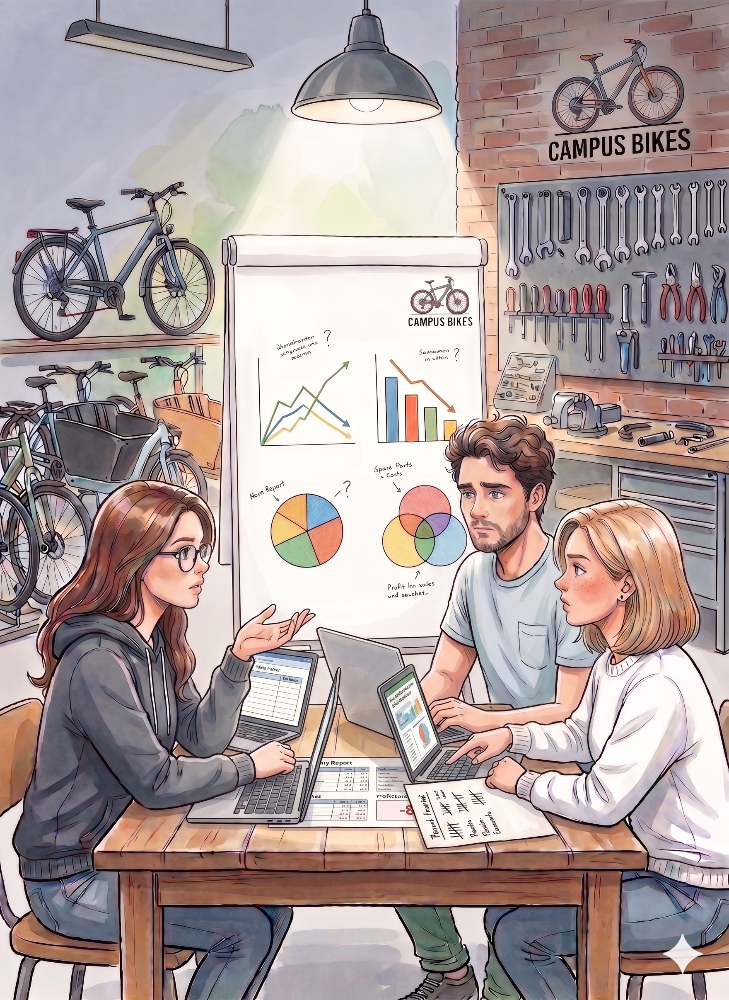
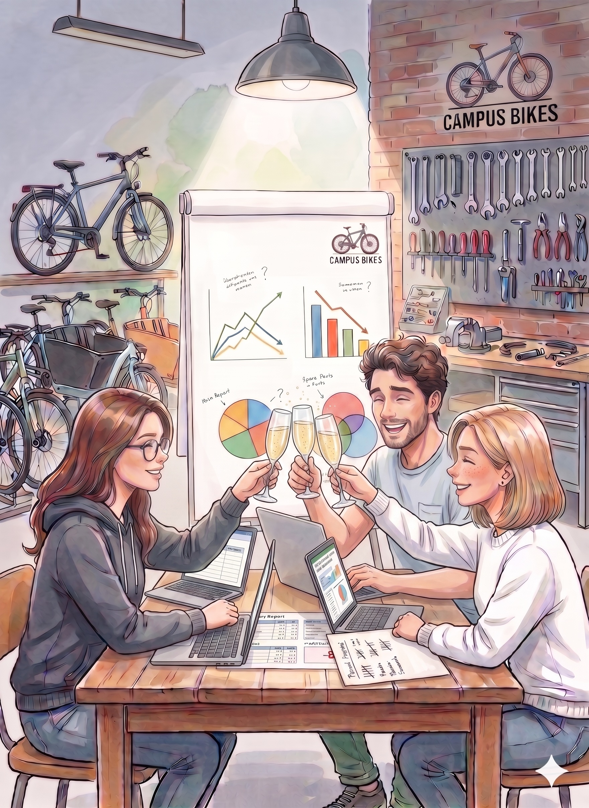

## Einleitung

Monat 2 in Jahr 2 ist abgeschlossen. Hanna, Daniel und Mia blicken auf ein gemischtes Bild: Weniger Reparaturen als geplant, aber deutlich mehr Fahrradverkäufe und wachsendes Abo-Geschäft. Der Studentenwerk-Vertrag, den Hanna Ende Monat 1 unterzeichnet hatte, zeigt erste Wirkung: 8 der 28 verkauften Fahrräder gingen direkt an den Campusfuhrpark. Das Betriebsergebnis hat sich gegenüber dem Vormonat verbessert, aber ein kleines Minus bleibt.

::: {.callout-important title="Managementproblem"}

Das Team stellt fest: Die Zahlen sind da, aber das Steuern aus dem Bauchgefühl heraus wird mit drei Leistungsbereichen zunehmend schwieriger. Hanna formuliert es so: „Wir wissen jetzt, was es kostet und was wir verdienen. Aber wie stellen wir sicher, dass wir uns jeden Monat in die richtige Richtung bewegen?"

CampusBikes verfügt inzwischen über ein vollständiges Bild seiner Kosten- und Ergebnisstruktur.
Was fehlt, ist ein **Steuerungssystem**: Kennzahlen, Ziele und Instrumente, die sicherstellen, dass das Team fokussiert bleibt und rechtzeitig erkennt, wenn etwas aus dem Ruder läuft.

{fig-align="center" width="400"}

Auf dem Tisch liegen drei offene Laptops: Daniel hat seine Werkstattzahlen in einer Tabellenkalkulation, Mia trackt Abo-Zu- und -Abgänge auf einem Zettel, Hanna überblickt den Verkauf aus dem Gedächtnis. Jede Person steuert ihren Bereich, aber niemand sieht das Gesamtbild.

:::

## Entscheidungsfrage

Welche Kennzahlen und Steuerungsinstrumente helfen CampusBikes, die richtigen Prioritäten zu setzen und zielorientiert zu handeln?

## Ist-Zahlen Monat 2 (mit Plan-Vergleich)

| Kennzahl | Plan | Ist | Abw. abs. | Abw. % |
|---|---:|---:|---:|---:|
| Reparaturaufträge | 200 | 175 | −25 | −12,5 % |
| Fahrräder verkauft | 20 | 28 | +8 | +40,0 % |
| Aktive Abonnements | 100 | 115 | +15 | +15,0 % |
| DB I Reparatur | 8.600 € | 7.525 € | −1.075 € | −12,5 % |
| DB I Fahrrad | 3.600 € | 5.040 € | +1.440 € | +40,0 % |
| DB I Abo | 2.000 € | 2.300 € | +300 € | +15,0 % |
| **DB I gesamt** | **14.200 €** | **14.865 €** | **+665 €** | **+4,7 %** |
| Bereichsfixkosten | 11.000 € | 11.000 € | 0 € | 0 % |
| Unternehmensfixkosten | 4.000 € | 4.000 € | 0 € | 0 % |
| **Betriebsergebnis** | **−800 €** | **−135 €** | **+665 €** | — |

---

## Aufgabe 1

Hanna schlägt vor, Moritz künftig an der Anzahl abgeschlossener Reparaturen pro Tag zu messen um die Auslastung der Werkstatt zu steigern.

a) Erklären Sie allgemein: Wie beeinflussen Kennzahlen und Ziele das Verhalten von Mitarbeitenden?

b) Welche unerwünschten Effekte könnte die Kennzahl „Reparaturen pro Tag" bei Moritz auslösen?

c) Wie könnte CampusBikes die Steuerung der Werkstatt besser gestalten?

::: {.callout-note collapse="true" title="Musterlösung Aufgabe 1"}

**a) Wie Kennzahlen Verhalten steuern**

Kennzahlen lenken Aufmerksamkeit. Was gemessen wird, gewinnt an Bedeutung; was nicht gemessen wird, tritt in den Hintergrund. Menschen optimieren tendenziell das, woran sie gemessen und beurteilt werden.

Ziele und Kennzahlen erfüllen damit drei Funktionen:

- **Orientierung:** Sie zeigen, worauf es ankommt.
- **Koordination:** In Teams sorgen gemeinsame Kennzahlen dafür, dass alle in dieselbe Richtung arbeiten.
- **Motivation:** Erreichbare Ziele fördern Engagement; unerreichbare Ziele wirken demotivierend.

**b) Mögliche Fehlanreize bei „Reparaturen pro Tag"**

Moritz könnte versuchen, seine Kennzahl zu maximieren, indem er:

- Reparaturen schneller abarbeitet, als es die Qualität erlaubt → mehr Folgeschäden, Kundenbeschwerden
- einfache Reparaturen bevorzugt und aufwendige Aufträge verzögert oder meidet
- Teile nur provisorisch repariert, um das Ticket schnell zu schließen

Keines dieser Verhaltensweisen liegt im Interesse von CampusBikes, aber alle sind eine rationale Reaktion auf eine einseitige Kennzahl.

**c) Bessere Steuerung der Werkstatt**

Eine einzige Kennzahl reicht selten aus. Sinnvoller ist ein ausgewogenes Set, das verschiedene Dimensionen abdeckt:

| Dimension | Kennzahl |
|---|---|
| Effizienz | Reparaturen pro Arbeitstag |
| Qualität | Anteil Reparaturen ohne Folgebeanstandung |
| Kundenzufriedenheit | Bewertung auf Campus-Plattform (Ø Sterne) |
| Wirtschaftlichkeit | DB I pro Reparatur |

Die Kombination schützt vor Optimierung auf Kosten anderer Ziele.

:::

---

## Aufgabe 2

Entwickeln Sie ein **Kennzahlenset** für CampusBikes mit je 2–3 finanziellen und 2–3 nichtfinanziellen Kennzahlen pro Bereich.

Beurteilen Sie außerdem: Welche Aussagekraft hat die Kennzahl „Umsatz pro Monat" und wo stößt sie an ihre Grenzen?

::: {.callout-note collapse="true" title="Musterlösung Aufgabe 2"}

**Kennzahlenset CampusBikes**

| Bereich | Finanzielle Kennzahlen | Nichtfinanzielle Kennzahlen |
|---|---|---|
| Reparatur | DB I/Auftrag, DB II Reparatur, Reparaturanteil am Gesamtumsatz | Ø Reparaturzeit , Beanstandungsquote, Auslastungsgrad Werkstatt |
| Fahrradverkauf | DB I/Fahrrad, Lagerumschlag, Verkaufsquote (Beratung → Kauf) | Kundenzufriedenheit, Wiederkaufquote, Ø Beratungszeit |
| Verleih/Abo | DB I/Abo, Abo-Bestand, Churn-Rate | Aktive Abonnements, Nutzungsfrequenz, Ø Abo-Laufzeit |
| Gesamt | Betriebsergebnis, DB I gesamt, Fixkostendeckungsgrad | Gesamtkundenbewertung, Beschwerden/Monat, Teamzufriedenheit |

**Grenzen der Kennzahl „Umsatz pro Monat"**

Umsatz zeigt, wie viel CampusBikes verkauft, aber nicht, ob es dabei verdient. Ein hoher Umsatz mit niedrigen Deckungsbeiträgen ist schlechter als ein geringerer Umsatz mit soliden Margen.

Konkret für CampusBikes: Der Fahrradverkauf erzeugt pro Einheit 300 € Umsatz, aber mit variablen Kosten von 120 € und hohen Bereichsfixkosten bleibt wenig übrig. Umsatz allein würde den Verkaufsbereich besser aussehen lassen, als er wirtschaftlich ist.

**Faustregel:** Umsatz ist ein Aktivitätsindikator, kein Erfolgsindikator. Er sollte immer mit Deckungsbeitrags- oder Ergebniskennzahlen kombiniert werden.

:::

---

## Aufgabe 3

Analysieren Sie die folgenden drei Situationen bei CampusBikes. Identifizieren Sie jeweils den Fehlanreiz und erklären Sie, welches Verhalten er auslösen könnte.

| Situation | Beschreibung |
|---|---|
| A | Der Verkaufsbereich wird am monatlichen Umsatz gemessen. |
| B | Das Abo-Team wird an der Zahl der **Neuabonnements** pro Monat gemessen. |
| C | CampusBikes misst den Erfolg des gesamten Unternehmens nur am **Betriebsergebnis** des laufenden Monats. |

::: {.callout-note collapse="true" title="Musterlösung Aufgabe 3"}

**Situation A: Steuerung Verkauf über Umsatz**

Fehlanreiz: Das Verkaufsteam maximiert den Umsatz, nicht den Deckungsbeitrag.

Mögliches Verhalten:

- Bevorzugen teurer Fahrräder, auch wenn günstigere für den Kunden besser passen
- Rabatte vermeiden, um Umsatz hochzuhalten, auch wenn ein Rabatt den Kunden gewinnen würde
- Keine Rücksicht auf Lagerkosten oder Kapitalbindung

Besser: Steuerung über DB I pro Verkauf, kombiniert mit Kundenzufriedenheitskennzahl.

---

**Situation B: Steuerung Abo über Neuabonnements**

Fehlanreiz: Das Team optimiert Neuanmeldungen, ignoriert aber Kündigungen (Churn).

Mögliches Verhalten:
- Aggressive Werbung für neue Kunden, kaum Pflege bestehender Kunden
- Abo-Bestand stagniert trotz hoher Neuanmeldungen, weil viele kündigen
- Qualitätsprobleme (schlechte Fahrräder, langsamer Service) werden nicht adressiert, weil sie nicht gemessen werden

Besser: Steuerung über Netto-Abo-Wachstum (Neuzugänge − Kündigungen) und Churn-Rate.

---

**Situation C: Steuerung über kurzfristiges Betriebsergebnis**

Fehlanreiz: Das Team optimiert den aktuellen Monat auf Kosten der Zukunft.

Mögliches Verhalten:
- Verzicht auf Investitionen in neue Fahrräder oder Marketing, um Kosten zu senken
- Ablehnen von Projekten mit langfristigem Potenzial (z.B. Aufbau Abo-Kundenstamm), weil sie kurzfristig Kosten verursachen
- Keine Ausbildung oder Weiterentwicklung, da dies ebenfalls das Monatsergebnis belastet

Besser: Mischung aus kurzfristigen Ergebniskennzahlen und langfristigen Wachstums- und Investitionskennzahlen, etwa über eine Balanced Scorecard.

:::

---

## Aufgabe 4

Analysieren Sie die Soll-Ist-Abweichungen aus Monat 2 (siehe Datentabelle am Anfang des Kapitels).

a) Welche Abweichungen sind aus Ihrer Sicht kritisch und welche sind eher positiv zu bewerten?

b) Formulieren Sie für jede der drei Abweichungen beim DB I eine mögliche Ursache und eine konkrete Managementmaßnahme.

::: {.callout-note collapse="true" title="Musterlösung Aufgabe 4"}

**a) Bewertung der Abweichungen**

| Bereich | Abweichung DB I | Bewertung |
|---|---:|---|
| Reparatur | −1.075 € | **Kritisch**: Reparatur ist der größte DB-I-Beitrag. Weniger Aufträge als geplant belasten das Gesamtergebnis spürbar. |
| Fahrradverkauf | +1.440 € | **Positiv**: Deutlich über Plan. Möglicher Semesterbeginn-Effekt mit höherer Kaufbereitschaft. |
| Monatsabo | +300 € | **Positiv, aber moderat**: Wachstum in die richtige Richtung; Zielauslastung noch nicht erreicht. |
| **Gesamt** | **+665 €** | **Leicht positiv**: Besser als geplant, aber das Betriebsergebnis bleibt negativ. Der Trend stimmt. |

**b) Ursachen und Maßnahmen**

**Reparatur (−25 Aufträge, −1.075 € DB I)**

Mögliche Ursache: Semesterbeginn. Studierende sind neu am Campus, haben ihre Fahrräder noch nicht oder sind noch nicht in der Routine, Reparaturen zu beauftragen.

Maßnahme: Gezielte Werbung zu Semesterbeginn (z.B. Aushänge, Campus-App, Kooperation mit Studierendenwerk), Aktionsangebot „Semesterstart-Check" für 49 € statt 75 €.

---

**Fahrradverkauf (+8 Fahrräder, +1.440 € DB I)**

Mögliche Ursache: Semesterbeginn-Effekt. Erstsemester kaufen Fahrräder für den Campusalltag. Zudem könnte das Studentenwerk-Paket (Kap. 4) zum Abschluss gekommen sein.

Maßnahme: Lagerbestand für zukünftige Semesterbeginne erhöhen, um Nachfragespitzen bedienen zu können. Prüfen: War die Marge bei den zusätzlichen Verkäufen auf Planniveau?

---

**Monatsabo (+15 Abonnements, +300 € DB I)**

Mögliche Ursache: Mund-zu-Mund-Empfehlungen unter Studierenden. Eventuell hat auch ein Instagram-Post von Mia zur Semesterbeginn-Kampagne beigetragen.

Maßnahme: Den Wachstumstrend aktiv unterstützen (Empfehlungsprämie für bestehende Kunden, Erstsemester-Paket). Beobachten: Wie entwickelt sich die Churn-Rate ab Monat 3?

:::

---

## Aufgabe 5

CampusBikes möchte ein einfaches Steuerungssystem einführen. Hanna schlägt eine **Balanced Scorecard** vor, Daniel bevorzugt **OKR**.

a) Skizzieren Sie eine Balanced Scorecard für CampusBikes mit je einer Kennzahl und einem Zielwert pro Perspektive.

b) Formulieren Sie alternativ ein OKR-Set mit einem Objective und drei Key Results für das kommende Quartal.

c) Vergleichen Sie beide Ansätze: Was passt besser zu CampusBikes in dieser Phase und warum?

::: {.callout-note collapse="true" title="Musterlösung Aufgabe 5"}

**a) Balanced Scorecard CampusBikes**

Die BSC betrachtet das Unternehmen aus vier Perspektiven und stellt sicher, dass finanzielle und nichtfinanzielle Ziele gleichgewichtig verfolgt werden.

| Perspektive | Ziel | Kennzahl | Zielwert |
|---|---|---|---:|
| **Finanzen** | Profitabilität erreichen | Betriebsergebnis | ≥ 0 € bis Ende Q2 |
| **Kunden** | Empfehlungsbereitschaft steigern | Ø Kundenbewertung (Campus-Plattform) | ≥ 4,5 / 5,0 |
| **Interne Prozesse** | Reparaturqualität sichern | Beanstandungsquote | ≤ 5 % |
| **Lernen & Entwicklung** | Kernprozesse standardisieren | Dokumentierte Reparaturabläufe | ≥ 3 bis Q2-Ende |

Die vier Perspektiven bilden eine Ursache-Wirkungskette: Standardisierte Abläufe (L&E) ermöglichen gleichmäßigere Reparaturqualität → weniger Beanstandungen (Interne Prozesse) → zufriedenere Kunden empfehlen CampusBikes weiter → mehr Aufträge und Deckungsbeitrag → positives Finanzergebnis.

---

**b) OKR-Set für das kommende Quartal**

**Objective:** CampusBikes hat sich als die verlässliche erste Anlaufstelle für Fahrradbedarf auf dem Campus etabliert.

| Key Result | Messgröße | Zielwert |
|---|---|---:|
| KR1 | Anteil Reparaturen nach dokumentierter Checkliste abgeschlossen | ≥ 90 % |
| KR2 | Persönliche Follow-up-Kontakte mit Bestandskunden | ≥ 20 pro Monat |
| KR3 | Aktiv initiierte Erstkontakte mit neuen Zielgruppen am Campus (Fachschaften, Wohnheime, Sportzentrum) | ≥ 5 pro Monat |

OKR-Prinzip: Das Objective ist qualitativ und inspirierend, die Key Results sind konkret messbar. Am Quartalsende wird offen bewertet, wie weit die Ziele erreicht wurden (0–100 %).

Das OKR-Set entspricht den Qualitätsansprüchen an gute OKRs: Das Objective beschreibt einen **abgeschlossenen Zustand** und ist **Outcome-orientiert**. Es beschreibt, was am Ende gilt, nicht was getan wurde. Die drei Key Results sind **Lead Measures**: Sie beschreiben unmittelbar beeinflussbare Aktivitäten, nicht deren Ergebnisse. Sie sind **mehrdimensional** (Prozessqualität, Kundenbindung, Marktpräsenz) und **unabhängig** voneinander messbar. Jedes KR beantwortet die Frage „Wie erreichen wir das Objective?" aus einem anderen Blickwinkel: konsequente Qualitätsprozesse (KR1), aktive Kundenpflege (KR2) und gezielte Sichtbarkeit am Campus (KR3).

---

**c) Vergleich: BSC vs. OKR für CampusBikes**

| Merkmal | Balanced Scorecard | OKR |
|---|---|---|
| Struktur | Vier Perspektiven, dauerhaft | Flexibel, quartalsweise |
| Aufwand | Höher (Aufbau und Pflege) | Niedrig (schnell einsetzbar) |
| Stärke | Vollständigkeit, Verknüpfungen | Fokus, Einfachheit, Agilität |
| Schwäche | Kann bürokratisch wirken | Kann Ziele verengen |
| Passung CampusBikes | Mittelfristig sinnvoll | Jetzt ideal, schnell einführbar |

**Empfehlung:** In der aktuellen Wachstumsphase empfiehlt sich **OKR** durch den klarer Fokus auf die drei entscheidenden Größen Key Results. Die BSC kann eingeführt werden, wenn das Unternehmen größer wird und mehr Steuerungsebenen braucht.

:::

---

## Ergebnis: CampusBikes am Ende von Jahr 2

Hanna, Daniel und Mia haben in diesem Semester einen langen Weg zurückgelegt.

| Kapitel | Frage | Erkenntnis |
|---|---|---|
| 1 | Warum reicht die GuV nicht aus? | Externes RW zeigt das Gesamtergebnis und nicht, wo es entsteht. |
| 2 | Welche Kosten entstehen? | Kostenarten, Fix- vs. variable Kosten, Einzel- vs. Gemeinkosten. |
| 3 | Wo entstehen Gemeinkosten? | BAB verteilt Kosten auf Werkstatt, Verkauf und Verleih. |
| 4 | Was kostet ein Produkt? | Zuschlagskalkulation liefert Selbstkosten und Angebotspreise. |
| 5 | Welche Leistungen lohnen sich? | Alle Bereiche decken ihre direkten Kosten; die geteilte Infrastruktur (Verwaltung + IT) ist der Engpass. |
| 6 | Wie steuern wir CampusBikes? | Kennzahlen, Soll-Ist-Analyse, BSC und OKR geben Orientierung. |

::: {.callout-tip title="Abschluss der Fallstudie"}
CampusBikes hat jetzt das Fundament für eine professionelle Unternehmenssteuerung. Das Betriebsergebnis tendiert gegen null, aber auf dem Tisch liegt bereits die nächste konkrete Entscheidung.

Mia will die Fahrradflotte für den Verleih erweitern: mehr Kapazität, schneller zum Break-Even-Point, aber kurzfristig höhere Fixkosten. Daniel hat ausgerechnet, dass rund 20 zusätzliche Reparaturaufträge pro Monat ausreichen würden, um CampusBikes dauerhaft in die Gewinnzone zu bringen. Hanna glaubt, dass ein zweites Studentenwerk-Paket im nächsten Semester realistisch ist, wenn die Kundenbewertungen stimmen.

{fig-align="center" width="400"}

Drei Szenarien, eine Entscheidung, ein Steuerungssystem. Das interne Rechnungswesen hat seinen Zweck erfüllt: Es macht wirtschaftliche Entscheidungen sichtbar, begründbar und steuerbar.
:::
