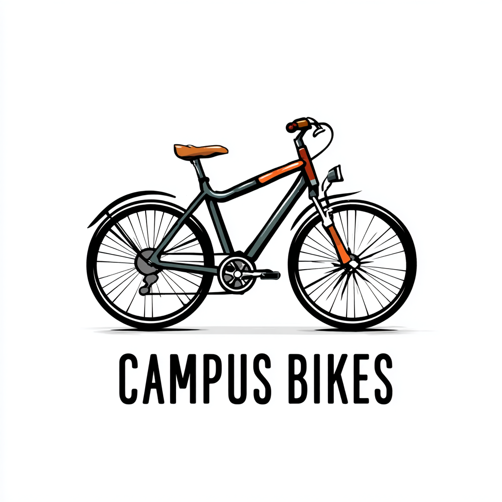

{fig-align="center" width="200"} 

# Willkommen

Im Mittelpunkt dieser Fallstudie steht das fiktive Start-up **CampusBikes GmbH**.

::: {.callout-tip title="Aufbau Campus Bikes GmbH"}
Drei Studierende – Hanna, Daniel und Mia – haben das Start-up „CampusBikes“ gegründet (Rechtsform: GmbH). Die drei haben klare Verantwortungsbereiche: **Hanna** verantwortet den Fahrradverkauf, **Daniel** die Werkstatt und Reparaturen, **Mia** den Verleih und das Abo-Geschäft. Die drei haben bereits externes Rechnungswesen kennengelernt und möchten nun verstehen, wie internes Rechnungswesen ihnen hilft, bessere Entscheidungen zu treffen.
:::

## Kapitelübersicht

:::: {.grid}

::: {.g-col-12 .g-col-md-6 .g-col-lg-4}
::: {.card .h-100}
::: {.card-body}
### [1 – Grundlagen](01-grundlagen.qmd)
Welche Zahlen brauchen wir intern zusätzlich zum Jahresabschluss?
:::
:::
:::

::: {.g-col-12 .g-col-md-6 .g-col-lg-4}
::: {.card .h-100}
::: {.card-body}
### [2 – Kostenarten](02-kostenarten.qmd)
Welche Kosten entstehen tatsächlich und wie verhalten sie sich?
:::
:::
:::

::: {.g-col-12 .g-col-md-6 .g-col-lg-4}
::: {.card .h-100}
::: {.card-body}
### [3 – Kostenstellen](03-kostenstellen.qmd)
Wo entstehen Gemeinkosten im Betrieb?
:::
:::
:::

::: {.g-col-12 .g-col-md-6 .g-col-lg-4}
::: {.card .h-100}
::: {.card-body}
### [4 – Kostenträger](04-kostentraeger.qmd)
Was kostet ein Produkt oder Auftrag?
:::
:::
:::

::: {.g-col-12 .g-col-md-6 .g-col-lg-4}
::: {.card .h-100}
::: {.card-body}
### [5 – Erfolgsrechnung](05-erfolgsrechnung.qmd)
Welche Angebote tragen zum Ergebnis bei?
:::
:::
:::

::: {.g-col-12 .g-col-md-6 .g-col-lg-4}
::: {.card .h-100}
::: {.card-body}
### [6 – Controlling](06-controlling.qmd)
Wie steuern wir CampusBikes zielorientiert?
:::
:::
:::

::::

## Arbeitshinweise

Die Zahlen sind **kapitelübergreifend konsistent**: Die Ergebnisse eines Kapitels fließen direkt in das nächste ein. Die Fallstudie ist so angelegt, dass Studierende zunächst selbst rechnen, diskutieren und entscheiden. Direkt danach folgt jeweils eine Musterlösung, damit auch Studierende mit fehlerhaften Zwischenergebnissen weiterarbeiten können. 

